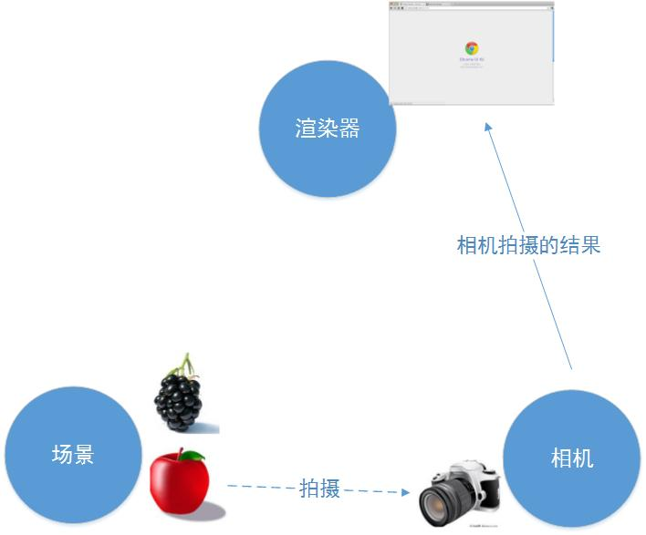

* 三大组件

three.js 要渲染物体到网页中，我们需要3个组建：场景（scene）、相机（camera）和渲染器（renderer）

1. 场景

    在Threejs中场景就只有一种，用THREE.Scene来表示, 构建场景 new THREE.Scene()
    
2. 相机

    比较类似人拍照，不通的位置都能看到不同的景色。相机有很多种，比如透视相机等
    
    `new THREE.PerspectiveCamera(...args)`
    
3. 渲染器
    
   渲染器决定了渲染的结果应该画在页面的什么元素上面，并且以怎样的方式来绘制。
   
   `new THREE.WebGLRenderer()`
   
4. 三大组件的关系

   
   
   场景是容器，需要的角色需要放入到场景中，同时角色自身也管理着其在场景中的位置。
   
   相机则是在这个场景中选择一个合适的景，拍下来。
   
   渲染器就是将相机拍下来的图片，放到浏览器中去显示。
   

